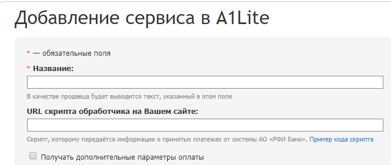

# Введение

Добро пожаловать на главную страницу технической документации РФИ Банка.
Здесь вы найдете необходимую информаци о взаимодействии сервисов партнера и Банка.

# Личный кабинет
В личном кабинете собраны различные инструменты:

- создание сервисов
- просмотр статистики платежей
- создание ссылок/кнопок/QR-кодов для оплаты
- инициализация и контроль возвратов
- создание и просмотр запросов в техническую поддержку Банка

Доступ в <a href='https://home.rficb.ru/'>ЛК</a> осуществляется по логину и паролю, который вы получите в процессе интеграции

## Сервисы

На одном логине может быть создано до 10 сервисов, каждый из них имеет свои настройки и набор параметров. Статистика платежей отображается для логина в целом

    <aside class="notice">
        Количество сервисов может быть увеличено по запросу в технческую поддержку. Текущий лимит указан в разделе **Инструменты** > **Сервисы**
	
    </aside>

### Создание и настройка сервиса
Для создания сервиса перейдите в раздел **Инструменты** > **Сервисы** и нажмите кнопку *Добавить сервис*. Откроется страница создания нового сервиса


Описание полей:

- **Название сервиса** – название, которое будет отображаться в списке ваших сервисов. Название, которое Вы введёте, будет отображаться в платёжном окне как «Продавец».
- **URL скрипта обработчика на Вашем сайте** – обработчик – это скрипт, которому передаётся информация о принятых платежах от системы Банка. Именно скрипт обработчика далее должен реализовывать логику (генерация кода, выдача товара, открытие доступа и т.д.). Если Вам не требуется выполнение действий, связанных с учётом денег, то скрипт обработчика можно не указывать.
- **URL страницы успешной покупки** – страница, на которую будет переадресовываться пользователь после успешной оплаты с передачей всех параметров платежа.
- **URL страницы ошибки** – страница, на которую будет переадресовываться пользователь, если во время проведения платежа возникла ошибка.
- **Секретный ключ сервиса** – ключ, по которому вы сможете подтверждать достоверность передаваемых данных. Если Вы указали адрес скрипта обработчика обязательно укаэите секретный ключ.
- **Email** – укажите Ваш email, если хотите получать уведомления о поступающих платежах.
- **При платеже обязательно указывать** – если Вам необходимо получать от пользователей email или телефон (чтобы прислать логин и пароль, уведомить и т.д.), то с помощью этого параметра Вы можете сделать эти поля обязательными для заполнения.
- **Способы оплаты** – выберете способы оплаты, которые вы хотите предлагать вашим клиентам.

# Webhook нотификации
## Стандартные параметры

# Формирование подписи
## Подпись v2.0
> Пример формирования подписи v2.0

```python
from urllib.parse import urlparse,quote
import hashlib
import urllib
import base64
import hmac
 
def sign(method, url, params, secret_key, exclude=['check', 'mac']):
    """
    Типовой метод для подписи HTTP запросов
    """
    url_parsed = urlparse(url)
    keys = [param for param in params if param not in exclude]
    keys.sort()
 
    result = []
    for key in keys:
        value = quote(
            (params.get(key) or '').encode('utf-8'),
            safe='~'
        )
        result.append('{}={}'.format(key, value))
 
    data = "\n".join([
        method,
        url_parsed.hostname,
        url_parsed.path,
        "&".join(result)
    ])
    secrkey = secret_key.encode('utf-8')
    mesg=data.encode('utf-8')
    print(secrkey,mesg)
    digest = hmac.new(
        secrkey,
        mesg,
        hashlib.sha256
    ).digest()
    signature = base64.b64encode(digest)
    print(signature.decode('utf-8'))
    return signature
//Пример вызова, где $req - массив с параметрами транзакции:
sign("GET", "https://partner.rficb.ru/alba/input/", {'login': 'newlogin~_-.'}, '165165165sd');
```
```java
package ru.rficb.alba;
 
import java.io.UnsupportedEncodingException;
import java.net.URLEncoder;
import java.nio.charset.Charset;
import java.security.InvalidKeyException;
import java.security.NoSuchAlgorithmException;
import java.util.ArrayList;
import java.util.Collections;
import java.util.List;
import java.util.Map;
import java.net.URI;
import java.net.URISyntaxException;
import javax.crypto.Mac;
import javax.crypto.spec.SecretKeySpec;
import javax.xml.bind.DatatypeConverter;

public class AlbaSigner {
 
    public static String sign(String method, String url, Map<String, String> params, String secretKey)
            throws URISyntaxException, UnsupportedEncodingException, NoSuchAlgorithmException, InvalidKeyException {
 
        URI uri = new URI(url);
 
        List keys = new ArrayList<>(params.keySet());
        Collections.sort(keys);
 
        StringBuilder sb = new StringBuilder();
        for (String key: keys) {
            if (sb.length() > 0) {
                sb.append("&");
            }
 
            sb.append(String.format("%s=%s", key, URLEncoder.encode(params.get(key), "UTF-8")));
        }
        String urlParameters = sb.toString();
        String data = method.toUpperCase() + "\n" +
                uri.getHost() + "\n" +
                uri.getPath() + "\n" +
                urlParameters;
 
        Mac hmacInstance = Mac.getInstance("HmacSHA256");
        Charset charSet = Charset.forName("UTF-8");
        SecretKeySpec keySpec = new javax.crypto.spec.SecretKeySpec(charSet.encode(secretKey).array(), "HmacSHA256");
        hmacInstance.init(keySpec);
 
        return DatatypeConverter.printBase64Binary(hmacInstance.doFinal(data.getBytes("UTF-8")));
    }
}
```
```php
<?php
 function http_build_query_rfc_3986($queryData, $argSeparator='&')
    {
        $r = '';
        $queryData = (array) $queryData;
        if(!empty($queryData))
        {
            foreach($queryData as $k=>$queryVar)
            {
                $r .= $argSeparator.$k.'='.rawurlencode($queryVar);
            }
        }
        return trim($r,$argSeparator);
    }
 
    function sign($method, $url, $params, $secretKey, $skipPort=False)
    {
        ksort($params, SORT_LOCALE_STRING);
 
        $urlParsed = parse_url($url);
        $path = $urlParsed['path'];
        $host = isset($urlParsed['host'])? $urlParsed['host']: "";
        if (isset($urlParsed['port']) && $urlParsed['port'] != 80) {
            if (!$skipPort) {
                $host .= ":{$urlParsed['port']}";
            }
        }
 
        $method = strtoupper($method) == 'POST'? 'POST': 'GET';
 
        $data = implode("\n",
            array(
                $method,
                $host,
                $path,
                http_build_query_rfc_3986($params)
            )
        );
 
        $signature = base64_encode(
            hash_hmac("sha256",
                "{$data}",
                "{$secretKey}",
                TRUE
            )
        );
 
        return $signature;
    }
 
// Пример вызова, где $req - массив с параметрами транзакции:
sign("GET", "https://partner.rficb.ru/alba/input/", $req, 'secret');
?>
```
Создать нормализованную строку запроса:

1. Отсортировать параметры по имени в кодировке **Utf-8**, сравнивая побайтово. Параметры берутся из GET URI или из тела POST запроса (когда Content-Type: application/x-www-form-urlencoded)
2. Кодировать имена и значения параметров по следующим правилам:
	* не кодировать определённые в **RFC 3986** незарезервированные символы. Эти символы: A-Z, a-z, 0-9, минус (-), подчёркивание (_), точка (.) и тильда (~).
	* все остальные символы должны быть закодированы как %XY, где X и Y это шестнадцатеричные символы от 0 до 9 и от A до F (заглавные). Расширенные **Utf-8** символы кодируются как %XY%ZA.
	* пробел кодируется как %20 (не как +, как обычно делается в URL).
	* кодированные имена параметров отделяются от кодированных значений знаком равно (=, **ASCII** код 61), даже если параметр имеет пустое значение.
	* пары имя–значение разделяются символом амперсанда (&, **ASCII** код 38).
3. Создать строку для подписи в соответствии со следующей псевдо грамматикой (где “\n” это **ASCII** символ перевода строки):
	* StringToSign = HTTPVerb + "\n" +
	* ValueOfHostHeaderInLowercase + "\n" +
	* HTTPRequestURI + "\n" +
	* CanonicalizedQueryString
4. Рассчитать совместимый с RFC 2104 HMAC по только что созданной строке StringToSign, используя секретный ключ партёра как ключ алгоритма, и SHA256 как способ хэширования.
5. Сконвертировать полученную подпись в base64.

Использовать результат как значение как check.

